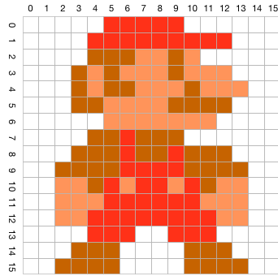

# Übungen: Information

#### Das Bit
Wie viele Zustände lassen sich mit einem Bit darstellen

---
Mit einem einzelnen Bit lassen sich zwei Zustände (der Wert 0 oder 1) darstellen.


#### Pi als Nachricht
Lässt sich die Zahl π als Nachricht übermitteln?

---
Die Zahl π ist eine reelle Zahl, und zwar eine transzendente Zahl mit unendlich vielen Stellen, deren Folge kein periodisches Muster bildet. Da von einer Nachricht gefordert werden muss, dass sie aus einer abzählbaren Folge von Einzelzeichen bestehen muss, kann π genau genommen nicht als Nachricht übermittelt werden. Man kann jedoch einen Näherungswert von π mit beliebig vielen Stellen übermitteln, oder auch eine Rechenvorschrift, die dem Empfänger prinzipiell die Berechnung beliebig vieler Stellen von π erlaubt.


#### Atome im Universum
Schätzungen zufolge besteht das Universum aus einer Tredezillion Atomen (10^78). Welche Bitbreite ist mindestens notwendig, um diese Zahl im Rechner zu speichern?

---
Die maximale Zahl, die sich mit n-Bit darstellen läßt ist 2^n. Insofern benötigt man zur Darstellung der Zahl 10^78 ln(10^78) = 260 Bit, da log_10(2^260) = 78,268 ist.


#### Umwandlung zwischen Zahlensystemen (Ganzzahlen)
Vervollständigen Sie die leeren Felder:

| Dezimal | Binär    | Oktal | Hexadezimal |
|---------|----------|-------|-------------|
| 198     |          |       |             |
|         | 10101101 |       |             |
|         |          |  535  |             |
|         |          |       | 4AC         |

---
|  Dezimal |  Binär       |  Oktal |  Hexadezimal |
|----------|--------------|--------|--------------|
| 198      | 11000110     |    306 |           C6 |
| 173      | 10101101     |    255 |           AD |
| 349      | 101011101    |    535 |          15D |
| 1196     | 10010101100  |   2254 |          4AC |


#### Umwandlung zwischen Zahlensystemen (Bruchzahlen)
Vervollständigen Sie die leeren Felder:

| Dezimal | Binär    | Oktal | Hexadezimal |
|---------|----------|-------|-------------|
| 521,125 |          |       |             |
|         | 1011,11  |       |             |
|         |          |  15,7 |             |
|         |          |       | AC,8        |


---
|  Dezimal  |  Binär          |  Oktal  |  Hexadezimal  |
|-----------|-----------------|---------|---------------|
|  521,125  |  1000001001,001 |  1011,1 |  209,2        |
|   11,75   |        1011,11  |    13,6 |    B,C        |
|   13,875  |        1101,111 |    15,7 |    D,E        |
|  172,5    |    10101100,1   |   254,4 |   AC,8        |


#### Gleitkommazahlen nach IEEE
Während der Fehlersuche stoßen Sie auf das folgende Speicherabbild:

`C0 98 00 00 00 00 00 00`

Welche Werte werden dargestellt, wenn Sie die Werte

1. als zwei IEEE-Gleitkommazahlen einfacher Genauigkeit bzw.
2. als eine IEEE-Gleitkommazahl doppelter Genauigkeit interpretieren?

Nehmen Sie für Ihre Betrachtung an, dass die Bytes in natürlicher Reihenfolge im Speicher abgelegt sind (Big-Endian-Format).

---
Zwei IEEE-Gleitkommazahlen einfacher Genauigkeit:
Zahl 1: 1100 0000 1001 1000 0000 0000 0000 0000
z=(−1)^1·1,0011·2^(129−127) = −4,75

Zahl 2: 0000 0000 0000 0000 0000 0000 0000 0000
z=(−1)^0·0,0=0

Eine IEEE-Gleitkommazahl doppelter Genauigkeit:

z=(−1)^1·1,1·2^(1033−1023) = −1536


#### Zweierkomplement
Wandeln Sie die Dezimalzahl -77 in eine binäre Darstellung mit 8 Bit um. Verwenden Sie die Zweierkomplementdarstellung für die Zahl.

---
77 = 01001101 binär

```console
01001101
10110010 Bits invertieren
10110011 + 1
========
```


#### Rechnen im Binärsystem
Führen Sie die folgenden binären Rechenoperationen durch

  * `110101 + 11001 =`
  * `111011 + 11101 =`
  * `111011 − 10111 =` (mit Zweierkomplement)
  * `110001 − 1101101 =` (mit Zweierkomplement)
  * `11011 * 1011 =`

  * `101,1101 + 1110,11 =`
  * `110,1001 − 101,11011 =`

---
```console
  110101   53       111011   59        0010111   23
+  11001   25      + 11101   29        1101001  (Zweierkomplement)
-------------      ------------      + 0111011   59
 1001110   78      1011000   88       -------------
                                    (1)0100100   36

 01101101  109
 10010011  (Zweierkomplement)
+  110001   49
--------------
 11000100  -60 (im Zweierkomplement)


 11011 * 1011  27 * 11 = 297
 ------------
 11011
   11011
    11011
 ------------
100101001


    101,1101    5,8125            110,10010    6,56250
 + 1110,11     14,7500          − 101,11011    5,84375
 ---------------------          ----------------------
 101000,1001   20,5625            000,10111    0,71875
```


#### Sinn des Zweierkomplements
Warum ist es sinnvoll, einen Wert im Zweierkomplement darzustellen, bzw. worin liegt der Vorteil zur Darstellung im Einerkomplement?

---
Beide Darstellungsweisen dienen zur Codierung von vorzeichenbehafteten Zahlenwerten. In beiden Darstellungsweisen wird das Vorzeichen durch das führende Bit, das MSB, festgelegt. Eine führende 0 ist als +, eine führende 1 als − festgelegt. In der Einerkomplementdarstellung muss bei negativen Werten eine bitweise Invertierung des Betragswert erfolgen. Die Zweierkomplementdarstellung benötigt ebenfalls bei negativen Zahlen eine bitweise Invertierung. Hier wird nach der Invertierung zusätzlich eine Addition mit 1 durchgeführt. Der Wert einer Bitfolge in Zweierkomplementdarstellung ergibt sich immer als Summe der Einzelwertigkeiten, wobei hier auch der Wert des Vorzeichenbits als negativer Summand zur Berechnung genutzt wird.


#### Bild codieren
Überlegen Sie sich ein Schema, wie das folgende Bild in Bits umgewandelt werden kann. Versuchen Sie die Daten so kompakt wie möglich abzulegen.



Codieren Sie die erste und die letzte Zeile nach Ihrem Schema und geben Sie das Ergebnis an. Gruppieren Sie dabei die Bits in Bytes.

---
weiß = 00
rot = 01
braun = 10
hellrot = 11

```console
1. Zeile:  00 00 00 00 00 01 01 01 01 01 00 00 00 00 00 00
16. Zeile: 00 00 01 01 01 01 00 00 00 00 01 01 01 01 00 00

1. Zeile:  00000000 00010101 01010000 00000000 = 0x00 0x15 0x50 0x00
16. Zeile: 00000101 01010000 00000101 01010000 = 0x05 0x50 0x05 0x50
```


#### Text codieren
Codieren Sie den folgenden Text in ISO-8859-1, UTF-8 und UCS2.

'Mögest Du viel Spaß haben!'

Geben Sie das Ergebnis als Bytes in hexadezimaler Schreibweise an.

---
ISO-8859-1:
4d f6 67 65 73 74 20 44 75 20 76 69 65 6c 20 53 70 61 df 20 68 61 62 65 6e 21

UTF-8:
4d c3 b6 67 65 73 74 20 44 75 20 76 69 65 6c 20 53 70 61 c3 9f 20 68 61 62 65 6e 21

UCS2:
004d 00f6 0067 0065 0073 0074 0020 0044 0075 0020 0076 0069 0065 006c 0020 0053 0070 0061 00df 0020 0068 0061 0062 0065 006e 0021

```ruby
def e(encoding)
  'Mögest Du viel Spaß haben!'.encode!(encoding, 'UTF-8').each_byte {|e| print e.to_s(16) + " " }
end

e(Encoding::ISO_8859_1)
puts "----"
e(Encoding::UTF_8)
puts "----"
e(Encoding::UTF_16)
```


#### Sampling-Rate
Warum haben CDs eine Abtastrate von 44,1 kHz?

---
Der menschliche Hörsinn geht von 16 Hz bis ca. 19 kHz. Bei einer Abtastrate von 44,1 kHz kann man gemäß Nyquist-Shannon-Abtasttheorem Frequenzen bis 22 kHz aufnehmen. Eine höhere Abtastrate würde es erlauben, höhere Frequenzen aufzuzeichnen, diese könnten aber nicht wahrgenommen werden und würden nur die Datenmenge vergrößern.


#### Datenmenge einer CD
Eine CD zeichnet Audiosignale mit 16 Bit bei 44,1 kHz Abtastrate unkomprimiert auf. Wie groß wird eine Stereo-CD mit 70 Minuten Laufzeit ungefähr?

---
Bei 44,1 kHz werden alle 44.100 * 2 Byte pro Sekunde erzeugt. Das sind 86 kB pro Sekunde oder 5 MB pro Minute. 70 Minuten ergeben damit 350 MB pro Stereo-Kanal oder 700 MB in Summe für ein Stereo-Signal.


#### Umrechnung von Speicherkapazitäten
Eine Festplatte ist mit einer Speicherkapazität von 4 TB angegeben. Wieviele Bytes können Sie darauf speichern?

---
Festplattenhersteller verwenden Zehnerpotenzen für die Größenangaben, damit die Platten größer erscheinen. 4 TB = 4 * 10^12 Byte. 4 * 10^2 / 2^40 = 3,64 TiB
