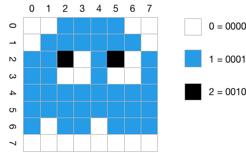
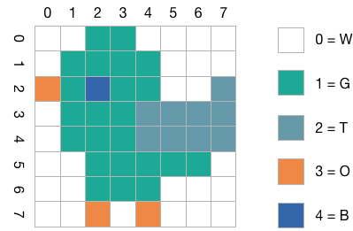

# Übungen: Codes

#### 1. Morse-Alphabet
Warum werden beim Morse-Alphabet manche Buchstaben mit kurzen und manche mit langen Folgen der Zeichen `.` und `−` dargestellt? Handelt es sich beim Morse-Alphabet um eine binäre Codierung?


#### 2. Fano-Bedingung
Genügt die Deutsche Sprache der Fano-Bedingung?


#### 3. Hamming-Distanz bestimmen
Bestimmen Sie die Hamming-Distanzen für die folgenden Codes:

  * { 110101, 101011, 010011, 101100 }
  * { 2B, 4A, 78, A9 }


#### 4. Hamming-Distanz anpassen
Bestimmen Sie die Hamming-Distanz für den Code {1101011, 1010110, 0000011, 0001100} und modifizieren Sie diesen Code dann durch Änderung eines einzigen Bit so, dass sich eine um eins erhöhte Hamming-Distanz ergibt.


#### 5. Serielle Daten dekodieren
Bei einer seriellen Datenübermittlung werden mit 7 Bit codierte ASCII-Zeichen mit einem zusätzlichen Paritätsbit und einem Längsprüfwort nach jeweils 8 Zeichen gesendet. Es gilt gerade Parität. Es
wird folgende Nachricht empfangen:

```console
1000110 1
0110010 0
1100101 0
1101001 0
1100010 1
1101001 0
1100101 0
1110010 0

0100100 0
```

Wie lautet die empfangene Nachricht? Sind Übertragungsfehler aufgetreten? Wenn ja, wie lautet die korrekte Nachricht?


#### 6. CRC-Prüfsumme berechnen
Berechnen Sie für die Nachricht `1101011010` die CRC-Prüfsumme mit dem Prüfpolynom `10011`.


#### 7. Daten mit CRC prüfen
Sie haben die Nachricht `100110110101` erhalten. Das Prüfpolynom ist `10011`. Ist die Nachricht korrekt übertragen worden?


#### 8. Komprimierung mit RLE
Komprimieren Sie das folgende Bild mit Hilfe eines Run-Length-Encodings (RLE). Geben Sie das Ergebnis an. Verwenden Sie der Einfachheit halber für alle Pixel eine Längenangabe und verzichten Sie auf das Markierungsbyte.



Wieviel Platz spart Ihre Codierung im Vergleich zu einer Speicherung ohne Kompression?


#### 9. Huffman-Code bestimmen
Gegeben ist folgende Häufigkeitsverteilung für eine Menge von Zeichen:

| Zeichen	      | R | I | C | H | T | G |
|---------------|---|---|---|---|---|---|
| Häufigkeit [%]|25 |21 |19 |18 |13 |4  |

Generieren Sie einen Huffman-Code für die angegebene Menge

Dekodieren Sie folgende Nachricht (von links nach rechts!) `0010110100110100111` mittels des generierten Code.


#### 10. Komprimierung mit LZ77
Komprimieren Sie das folgende Bild mit Hilfe des LZ77-Algorithmus. Verwenden Sie ein Datenfenster und einen Vorausschaupuffer der Größe 8. Geben Sie das Ergebnis in der Form (x, x, Z) an.




#### 11. GIF oder JPEG für Comics
Warum ist das GIF-Dateiformat besser geeignet, um farbige Comics zu speichern, als JPEG? Gibt es noch ein anderes Bildformat, dass sich für Comics eignet und das möglicherweise noch besser als GIF ist?


#### 12. Funktionsweise von MP3
Welche Eigenschaft des menschlichen Hörsinns wird vom MP3-Format genutzt?


#### 13. Fehlereigenschaften eines Codes
Angenommen ein 24-Bit-Code wäre so aufgebaut, dass er jedes Symbol durch drei aufeinanderfolgende Kopien des ASCII-Codes des Symbols repräsentiert. Welche Eigenschaften hätte dieser Code in Bezug auf Fehler?

