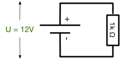
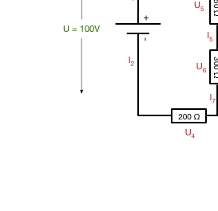

# Übungen

#### Aufgabe 1
Beweisen Sie mit Hilfe einer Wahrheitstabelle das De Morgansche Gesetz:
`!(P || Q) = !P && !Q`

#### Aufgabe 2
Stellen Sie eine Wahrheitstabelle für folgenden Ausdruck auf (P und Q sind Aussagen, die Wahr T oder Falsch F sein können): `(P && Q) || (!P && !Q)`

#### Aufgabe 3
Vereinfachen Sie durch elementare Umformungen den folgenden Ausdruck: `(A || B) && (!A && B)` Überprüfen Sie mit einer Wahrheitstabelle, ob das Ergebnis korrekt ist.

#### Aufgabe 4
Stellen Sie die zweistelligen logischen Verknüpfungen Implikation, NOR, NAND, Äquivalenz und XOR unter ausschließlicher Verwendung von Konjunktion, Disjunktion und Negation dar.

#### Aufgabe 5
Eine Schaltfunktion y mit drei Eingängen x1, x2, x3 sei durch folgende Funktionstabelle gegeben:

| x_1 | x_2 | x_3 | f  |
|-----|-----|-----|----|
|  0  |   0 |   0 |  0 |
|  0  |   0 |   1 |  1 |
|  0  |   1 |   0 |  1 |
|  0  |   1 |   1 |  0 |
|  1  |   0 |   0 |  0 |
|  1  |   0 |   1 |  1 |
|  1  |   1 |   0 |  1 |
|  1  |   1 |   1 |  1 |

Geben Sie die Schaltfunktion in disjunktiver Normalform an, erstellen Sie das zugehörige KV-Diagramm und vereinfachen Sie die Funktion so weit wie möglich.

#### Aufgabe 6
Berechnen Sie für den unten angegebenen Stromkreis, welche Leistung (in Watt) verbraucht wird.

#### Aufgabe 7
Berechnen Sie für den unten angegebenen Stromkreis alle fehlenden Größen.

#### Aufgabe 8
Entwerfen Sie unter Verwendung von Gattern mit zwei Eingängen ein Oder-Gatter mit 4 Eingängen.

#### Aufgabe 9
Entwerfen Sie eine Schaltung mit Gattern, die prüft ob einer der Passagiere seinen Gurt geschlossen hat (High-Signal vom Gurtsensor). Ist der Platz leer (Low-Signal vom Sitzplatzsensor)
so darf auch der Gurt offen sein. Ist der Platz besetzt und der Gurt offen soll die
Schaltung ein High-Signal ausgeben. Verknüpfen Sie dann zwei Sitzplätze zu einem Ergebnis-Signal.

Entwerfen Sie zuerst eine Wahrheitstabelle und geben Sie dann eine Schaltung mit Gattern an.
