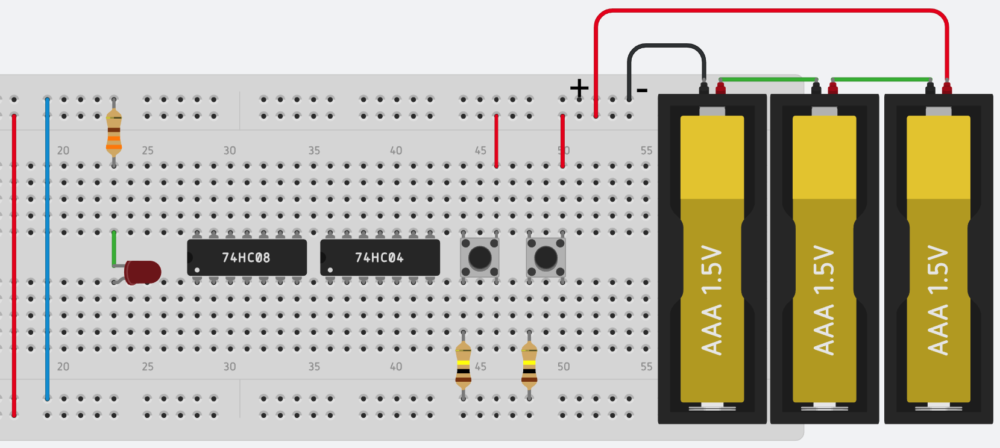
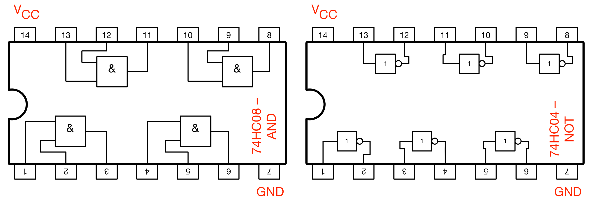

# Live-Übung -- 30.4.2018

Name: ...............................................  Matrikelnummer: ........................

Hinweis: Die Aufgaben verwenden der Einfachheit halber die Symbole aus Java für die Darstellung der

  * _Konjunktion_ (AND): `&`,
  * _Disjunktion_ (OR): `|` und
  * _Negation_ (NOT): `!`


#### Leistung eines Wasserkochers
Auf einem Wasserkocher steht 230V, 5A. Welche elektrische Leistung nimmt das Gerät auf?

---
<!-- Spacing: 7 -->
`P = U*I, U = 230V, I = 5A, P = 230V * 5A = 1150 W`


#### Logische Funktionen auf Bitfolgen anwenden
Berechnen Sie `(10010100 & !0101111)`:

---
<!-- Spacing: 12 -->

```console
!00101111 = 11010000 oder 1010000

   10010100       10010100
 & 11010000     &  1010000
 -----------    ----------
   10010000          10000
```


#### Bits maskieren
Angenommen, sie wollen in beliebigen Bitfolgen (8 Bit) die letzten beiden Bits immer auf Null setzen und das erste Bit immer auf Eins setzen, also z.B. aus `00101011` soll `10101000` werden. Wie können Sie dies mit entsprechenden booleschen Operatoren erreichen?

---
<!-- Spacing: 12 -->

Die Bifolge muss zuerst mit `11111100` per `&` und dann mit `100000000` per `|` verknüpft werden, z.B.

```console
   00101011
 & 11111100
 ----------
   00101000
 | 10000000
 ----------
   10101000
```


#### Ausdruck in Wahrheitstabelle darstellen
Stellen Sie eine Wahrheitstabelle für folgenden Ausdruck auf (P und Q sind Aussagen, die Wahr T oder Falsch F sein können): `(P & !Q) | (!P & !Q)`

---
<!-- Spacing: 12 -->

```console
P   Q   P & !Q    !P & !Q   Ergebnis
------------------------------------
T   F     T         F          T
T   T     F         F          F
F   F     F         T          T
F   T     F         F          F
```


#### Disjunktive Normalform
Eine Schaltfunktion y mit drei Eingägen x1, x2, x3 sei durch folgende Funktionstabelle gegeben:

| x1  | x2  |  x3 | f  |
|-----|-----|-----|----|
|  0  |   0 |   0 |  1 |
|  0  |   0 |   1 |  0 |
|  0  |   1 |   0 |  1 |
|  0  |   1 |   1 |  0 |
|  1  |   0 |   0 |  1 |
|  1  |   0 |   1 |  0 |
|  1  |   1 |   0 |  1 |
|  1  |   1 |   1 |  0 |

Geben Sie die Schaltfunktion in disjunktiver Normalform an und erstellen Sie das dazugehörige KV-Diagramm. Welche optimierte Funktion ergibt sich?


---
<!-- Spacing: 12 -->

Die disjunktive Normalform ist:

```console
f(x1, x2, x3)
  = (!x1 & !x2 & !x3) 
  | (!x1 & x2 & !x3) 
  | (x1 & !x2 & !x3) 
  | (x1 & x2 & !x3)
```

Das KV-Diagramm damit:


Damit ergibt sich die optimierte Funktion als: `f(x1, x2, x3) = !x3`


#### Schaltung vervollständigen

Gegeben ist die folgende Schaltung für einen Gurtwarner: Wenn der Sitz (S) besetzt ist und der Gurt (G) nicht geschlosse, wird am Ausgang E ein Warnsignal angezeigt.


Fügen Sie in die vorliegende Schaltung die fehlenden Verbindungen ein, damit der oben gezeigte Schaltplan realisiert ist.



Die Pinbelegung der Chips entnehmen Sie bitte folgender Abbildung



---


