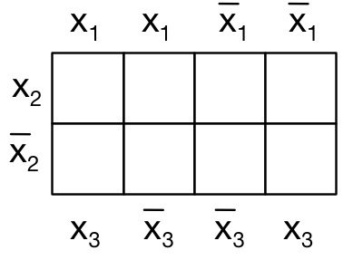
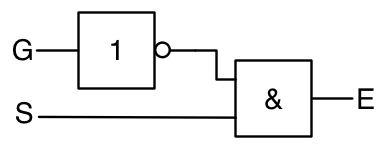
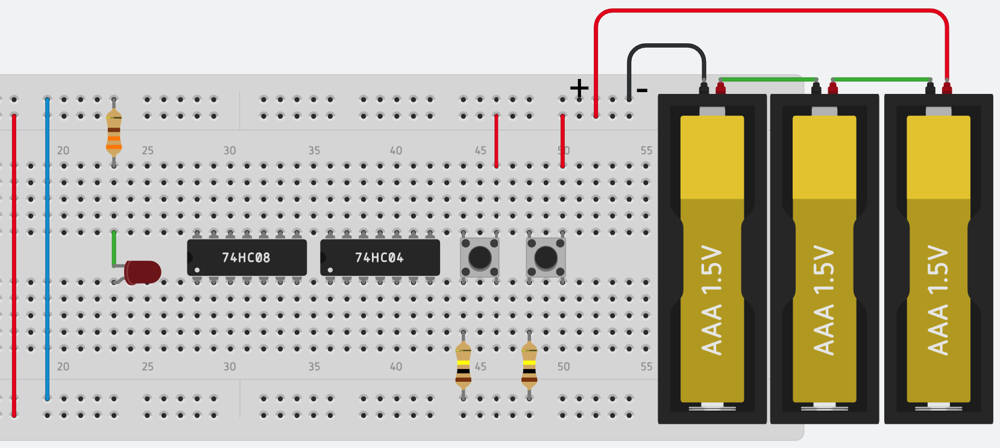
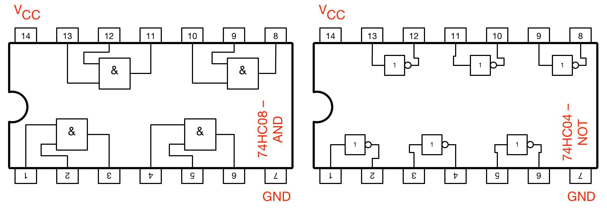

# Live-Übung -- 30.4.2018

Name: ...............................................  Matrikelnummer: ........................

Hinweis: Die Aufgaben verwenden der Einfachheit halber die Symbole aus Java für die Darstellung der

  * _Konjunktion_ (AND): `&`,
  * _Disjunktion_ (OR): `|` und
  * _Negation_ (NOT): `!`

#### 1. Leistung eines Wasserkochers
Auf einem Wasserkocher steht 230V, 5A. Welche elektrische Leistung nimmt das Gerät auf?

 
 
 
 
 
 
 

#### 2. Logische Funktionen auf Bitfolgen anwenden
Berechnen Sie `(10010100 & !0101111)`:

 
 
 
 
 
 
 
 
 
 
 
 

#### 3. Bits maskieren
Angenommen, sie wollen in beliebigen Bitfolgen (8 Bit) die letzten beiden Bits immer auf Null setzen und das erste Bit immer auf Eins setzen, also z.B. aus `00101011` soll `10101000` werden. Wie können Sie dies mit entsprechenden booleschen Operatoren erreichen?

 
 
 
 
 
 
 
 
 
 
 
 

#### 4. Ausdruck in Wahrheitstabelle darstellen
Stellen Sie eine Wahrheitstabelle für folgenden Ausdruck auf (P und Q sind Aussagen, die Wahr T oder Falsch F sein können): `(P & !Q) | (!P & !Q)`

 
 
 
 
 
 
 
 
 
 
 
 

#### 5. Disjunktive Normalform
Eine Schaltfunktion y mit drei Eingägen x1, x2, x3 sei durch folgende Funktionstabelle gegeben:

| x1  | x2  |  x3 | f  |
|-----|-----|-----|----|
|  0  |   0 |   0 |  1 |
|  0  |   0 |   1 |  0 |
|  0  |   1 |   0 |  1 |
|  0  |   1 |   1 |  0 |
|  1  |   0 |   0 |  1 |
|  1  |   0 |   1 |  0 |
|  1  |   1 |   0 |  1 |
|  1  |   1 |   1 |  0 |

Geben Sie die Schaltfunktion in disjunktiver Normalform an und erstellen Sie das dazugehörige KV-Diagramm. Welche optimierte Funktion ergibt sich?

 
 
 
 
 
 
 
 
 
 
 
 

#### 6. Schaltung vervollständigen

Gegeben ist die folgende Schaltung für einen Gurtwarner: Wenn der Sitz (S) besetzt ist und der Gurt (G) nicht geschlosse, wird am Ausgang E ein Warnsignal angezeigt.

Fügen Sie in die vorliegende Schaltung die fehlenden Verbindungen ein, damit der oben gezeigte Schaltplan realisiert ist.

Die Pinbelegung der Chips entnehmen Sie bitte folgender Abbildung

