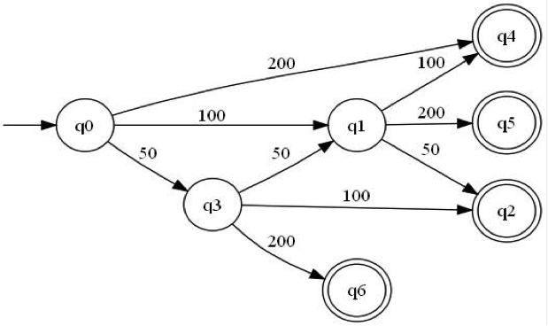

# Übungen: Formale Sprachen und Automaten

#### Parkscheinautomat
Auf einem Parkplatz kostet das Parken 1,50 Euro. Ein Parkscheinautomat akzeptiert 50 Cent, 1 Euro und 2 Euro-Münzen. Nach Einwurf der korrekten Geldsumme liefert er das Ticket und gegebenenfalls das Restgeld. Er besitzt keine Abbruchtaste.

Entwickeln Sie einen Automaten (DEA), der den Parkscheinautomaten realisiert, alle korrekten Geldbeträge akzeptiert und das richtige Restgeld zurückgibt.

---


  * q0: Startzustand
  * q4: Rückgeld 50 Cent
  * q5: Rückgeld 1,50 EUR
  * q2: Rückgeld 0 EUR
  * q6: Rückgeld 1 EUR


#### Regulärer Ausdruck für Matrikelnummern
Geben Sie einen regulären Ausdruck an, der die Matrikelnummern der Studierenden, die im Sommersemester 2018 angefangen haben (beginnen mit `181` und darauf folgen immer vier Ziffern) matched.

Erweitern Sie den regulären Ausdruck danach auf das Wintersemester 2017. Beachten Sie, dass die Matrikelnummern im Wintersemester mit `172` *und*
`173` beginnen können.

Testen Sie Ihren Ausdruck mit verschiedenen Matrikelnummern.

---
  * Sommersemester 2018: `/^181[0-9]{4}$/`
  * Wintersemester 2017: `/^17[23][0-9]{4}$`

Die `^` und `$` sind wichtig, da sonst auch längere Matrikelnummern, z.B. `21811111` oder `18111110` matchen würden.


#### Ersetzen mit einem regulären Ausdruck
Geben Sie einen regulären Ausdruck an, der alle Vorkommen von "e" in einem Text durch "3" ersetzt. Orientieren Sie sich an der Syntax des Unix-Werkzeugs `sed` bei der Angabe des Ausdrucks (extended regular expressions mit der `-E`-Option). Testen Sie den Ausdruck mit Hilfe von `sed`.

---
Ersetzen von "e" durch "3" im gesamten Text (`g` für *g*lobal): `s/e/3/g`


#### Wörter tauschen
Geben Sie einen regulären Ausdruck an, der zwei durch Bindestrich (`-`) verbundene Wörter vertauscht. Z.B. soll aus "Speicher-Fehler" das Wort "Fehler-Speicher" werden. Orientieren Sie sich an der Syntax des Unix-Werkzeugs `sed` bei der Angabe des Ausdrucks (extended regular expressions mit der `-E`-Option). Testen Sie den Ausdruck mit Hilfe von `sed`.

---
`sed -E 's/(.+)-(.+)/\2-\1/g'`


#### Greedy Match
Was ist damit gemein, wenn man bei regulären Ausdrücken von einem sogenannten "greedy match" spricht? Geben Sie ein Beispiel an.

---
"greedy match" mein, dass der reguläre Ausdruck immer versucht, so viele Zeichen wie möglich zu matchen, also "gierig" ist. Zum Beisiel würde `/<.*>/` bei dem Text `<a>hello</a>` nicht wie vielleicht zu erwarten, nur das `<a>` matchen, sondern den gesamten Text bis zur schließenden Klammer. Bei einigen Werkzeugen (leider nicht sed) kann man dieses Verhalten durch Anhängen eines `?` abschalten. `/<.*?>/` würde dann nur noch `<a>` matchen.


#### Backus-Naur-Form (BNF)
In C müssen Variablennamen nach der folgenden Regel gebildet werden: "Namen bestehen aus Buchstaben und Ziffern; dabei muss das erste Zeichen ein Buchstabe sein. Der Unterstrich zählt als Buchstabe."

Beschreiben Sie diese Regel mit einem Ausdruck in Backus-Naur-Form.
---

```console
<name> ::= <buchstabe> | <name> <buchstabe> | <name> <zahl>

<buchstabe> ::= _ | a | b | c | d | e | f | g | h 
              | i | j | k | l | m | n | o | p | q 
              | r | s | t | u | v | w | x | y | z 
              | A | B | C | D | E | F | G | H | I 
              | J | K | L | M | N | O | P | Q | R 
              | S | T | U | V | W | X | Y | Z

<zahl> ::= 0 | 1 | 2 | 3 | 4 | 5 | 6 | 7 | 8 | 9
```


#### Erweiterte Backus-Naur-Form (EBNF)
Gegeben sei die folgende Grammatik in EBNF-Form

```console
expression = term  { ("+" | "-") term };
term       = factor  { ("*" | "/") factor };
factor     = constant | variable | "(" expression ")";
variable   = "x" | "y" | "z";
constant   = digit {digit} ;
digit      = "0" | "1" ... "9";
```

Geben Sie mindestens vier beispielhafte Ausdrücke an, die von dieser Grammatik beschrieben werden.

---
Beispiele, die die Grammatik erfüllen:

```console
182 * x + x * z
333 / z
x / y
(333 / z) + (4 - 6)
```


#### 50 Affen
Zur Illustration der zeitlichen Komplexität führen Sie folgende Betrachtung durch: Wie wahrscheinlich ist es, dass 50 Affen an 50 Schreibmaschinen in 50 Jahren irgendwann auch die erste Seite von Shakespeares Drama "Hamlet" getippt haben würden (Groß- und Kleinschreibung wird ignoriert)? Machen Sie hierzu plausible Annahmen bzgl. der Zeichenzahl pro Seite und die Anzahl der Anschläge pro Sekunde.

---
Der Weltrekord für das Schnellschreiben auf der Schreibmaschine liegt bei 821 Anschlägen pro Minute, d.h. 13 Zeichen pro Sekunde. Nehmen wir an, die Affen wären fast auf dem Niveau des Weltrekordes und setzen 10 Zeichen pro Sekunde an. Damit schreiben 50 Affen in 1.577.880.000 Sekunden (50 * 365.25 * 24 * 60 * 60) insgesamt 788.940.000.000 Zeichen.

Bei einem Buch kann man von 30 Zeilen mit jeweils 60 Zeichen ausgehen, also 1800 Zeichen pro Seite.

Die Wahrscheinlichkeit, dass ein Affe das erste Zeichen richtig tippt beträgt 1/26, dass er zwei Zeichen richtig hat 1/26*1/26 etc. D.h. für die erste Seite beträgt die Wahrscheinlichkeit (1/26)^1800 bzw. 1/(26^1800). Die Wahrscheinlichkeit, dass die Affen es in 50 Jahren schaffen damit 1/(26^1800) * 788.940.000.000 oder 1:10^2535


#### Komplexität und Verständlichkeit
Wenn die Komplexität eines Algorithmus X größer als die eines Algorithmus Y ist, bedeutet dies, dass X schwerer zu verstehen ist als Y? Erläutern Sie Ihre Antwort.

---
Nein, die Komplexität bezieht sich auf das Laufzeitverhalten und nicht die Verständlichkeit. Oft sind sogar die Algorithmen mit höherer Komplexität besser zu verstehen, weil einfacher aufgebaut.


#### Komplexität bestimmen
Gegeben seien die folgenden Programmfragmente. Geben Sie die jeweilige Ausführungszeit an. Geben Sie den Aufwand mittels der O-Notation an. Sie dürfen davon ausgehen, dass der fehlende Schleifenrumpf eine konstante Ausführungszeit hat.

Fall 1:
```java
for (int i = 0; i < n; i++) {
    // Rumpf
}
```

Fall 2:
```java
for (int i = 0; i < n; i++) {
    // Rumpf
}

for (int k = 0; k < n; k++) {
    // Rumpf
}
```

Fall 3:
```java
for (int i = 0; i < n; i++) {
    for (int j = 0; j < n; j++) {
      // Rumpf
    }
}
```

Fall 4:
```java
for (int i = 0; i < n; i++) {
    for (int j = 0; j < i; j++) {
        // Rumpf
    }
}
```

Fall 5:
```java
for (int i = 0; i < n; i++) {
    for (int j = 0; j < n; j++) {
        for (int k = 0; k < n; k++) {
           // Rumpf  
        }        
    }
}
```

---
  * Fall 1: O(n)
  * Fall 2: O(n)
  * Fall 3: O(n^2)
  * Fall 4: O(n^2)
  * Fall 5: O(n^3)


#### Komplexität berechnen
Betrachten Sie folgende Messdaten, die für die Laufzeit eines Programms bei unterschiedlichen Datenmengen (n) ermittelt wurden:

  1. n^3 + 4n^2 + 2n + 12
  2. 2n(8 + log(n))
  3. (8n + 12) / 6
  4. 1 + 2 + 3 + 4 + ... + n
  5. 7 + log(n^3)
  6. 8n + log(n)

Geben Sie den Aufwand mittels der O-Notation an.

---
  1. O(n^3)
  2. O(n log(n))
  3. O(n)
  4. O(n^2)
  5. O(log(n))
  6. O(n)
